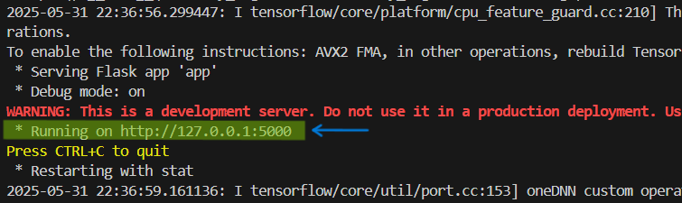

# 🎭 VAE Face Generator

This project is a **Variational Autoencoder (VAE)** trained to generate realistic human faces. The model has been trained on the [CelebA dataset](http://mmlab.ie.cuhk.edu.hk/projects/CelebA.html), which contains over 200,000 celebrity images. 

The final app allows users to **generate synthetic human faces** by sampling from a learned latent space. It is implemented in **TensorFlow** and deployed using **Flask** for local interaction.

---

## 🧠 Sample Results (Training Progress)

Below is a short video showing the model's progression during training — the generated faces improve as the model learns:

> 📹 **Video**: [`training_progress.mp4`](./training_progress.mp4)

[<video src="training_progress.mp4" controls autoplay loop muted width="100%"></video>](https://github.com/user-attachments/assets/35ce2664-19bc-4e47-ba33-089ff6574c24)

---

## 🧬 What is a VAE?

A **Variational Autoencoder** is a type of deep generative model that learns to represent input data (like faces) in a compressed latent space, and then reconstruct it with high fidelity.

### ✨ How It Works:
- **Encoder**: Compresses an image into a latent representation (mean & variance).
- **Reparameterization Trick**: A random vector is sampled using the latent mean and variance.
- **Decoder**: Takes this random vector and generates a new face image from it.

> Instead of learning a fixed latent code, the VAE learns **distributions**, making the generation **stochastic and continuous**.

---

## 🏗️ About the Model

- **Encoder**: Convolutional layers → Dense layers → Mean and log variance layers.
- **Latent Space**: 128 dimensions sampled via the reparameterization trick.
- **Decoder**: Fully connected layers → Conv2DTranspose layers to reconstruct the image.
## 🧪 How to Run Locally

### 🔧 Prerequisites

- Python 3.10 or later  
- Git  
- pip  

### 🛠️ Setup

```bash
# Clone the repo
git clone https://github.com/your-username/vae-face-generator.git
cd vae-face-generator

# Create a virtual environment
python -m venv venv
source venv/bin/activate  # On Windows: venv\Scripts\activate

# Install dependencies
pip install -r requirements.txt
```
### 🚀 Run the App
```bash
python app.py
```
Then open your browser at: http://127.0.0.1:5000
your loacl machine might have a diffrent address look for it in the terminal when you run the app.py as shown below:

</img>

### 🧊 What It Does
- Every time you click Generate, a new latent vector is randomly sampled.
- The decoder produces a face image from this latent vector.
- You can download the image directly from the UI.

